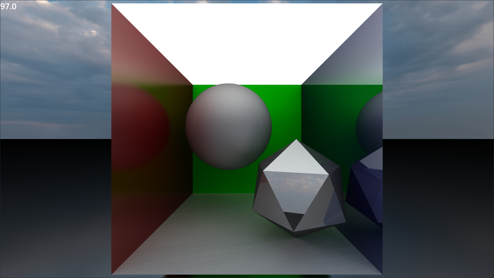

# A basic ray-tracing implementation in Godot

This project requires a GPU with compute shader support, and will not work with WebGL or the Godot compatability renderer.

Freecam is controlled like in the Godot editor - Hold right click to activate and use WASD or the arrow keys to move arround. Scroll wheel can be used to speed up or slow down. 

Based on [GPU Path Tracing in Unity by Three Eyed Games / David Kuri](https://web.archive.org/web/20231016082125/https://blog.three-eyed-games.com/2018/05/03/gpu-ray-tracing-in-unity-part-1/)

Skybox image is [Citrus Orchard (Pure Sky) by PolyHaven](https://polyhaven.com/a/citrus_orchard_puresky) 

[Freecam script by Adam Viola](https://github.com/adamviola/simple-free-look-camera)
